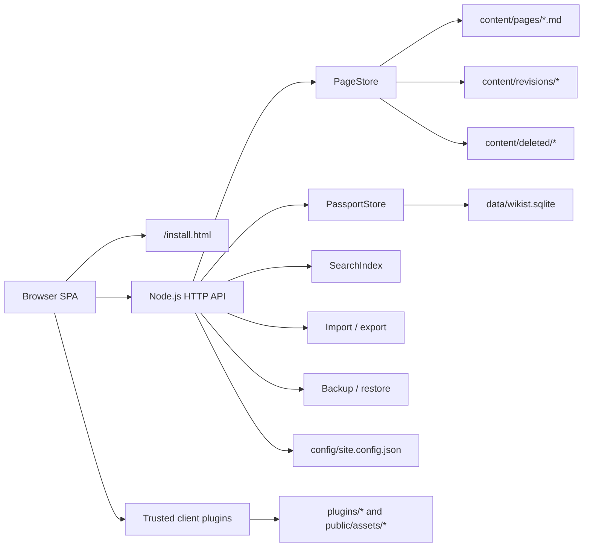

# Wikist Architecture

Wikist is a Chinese-first, mathematics-oriented wiki framework built around one principle: content must remain portable, while collaboration must remain auditable. It uses a small Node.js HTTP service, Markdown article files, and SQLite for identity and community state.

This document describes the implemented architecture, not an aspirational prototype.

## Design Position

- **MediaWiki**: stable article identity, revision history, page permissions, multilingual collaboration, citation discipline, and community review.
- **Wikipedia**: encyclopedic writing standards, source traceability, discussion around an article, and public quality signals.
- **Wiki.js**: a modern browser reading and editing experience.
- **Webman**: explicit routing, low runtime overhead, and a small operational footprint.

Wikist deliberately does not copy the full MediaWiki extension stack. A single-directory deployment with Markdown and SQLite is the default; large infrastructure is an opt-in future boundary.

## Runtime Shape



The frontend is a native JavaScript single-page application. It renders the reading, editing, translation, comment, account, search, import/export, and administration routes. It defers MathJax, plotting libraries, language conversion, and trusted client plugins until the active route needs them.

## Storage Boundaries

| Data | Primary store | Reason |
| :--- | :--- | :--- |
| Article body and front matter | `content/pages/` Markdown | Human-readable, Git-friendly, easy to copy and review; also carries categories, topic, notation, prerequisite and related-page metadata |
| Revision snapshots | `content/revisions/` | Keeps page history independent from database migration |
| Deleted-page archives | `content/deleted/` | Recoverable deletion without exposing archived content as a live page |
| Accounts and sessions | SQLite | Transactional identity state and HttpOnly sessions |
| Permissions, edits, comments, ratings, favorites, watch subscriptions, messages, translations, audit logs, page links, aliases | SQLite | Queryable collaboration and knowledge-graph state with indexes |
| Site configuration | `config/site.config.json` | Per-site settings kept outside the public release package |
| Plugin manifests and trusted modules | `plugins/` | Explicit local installation and review boundary |

The public framework repository excludes local content, database files, upload files, logs, generated configuration, and upstream vendor caches. A deployed site can therefore publish its framework code without publishing its contributors or its private editorial history.

## Request And Collaboration Flow

1. A first-run server exposes only the installer until `config/site.config.json` is written.
2. Normal requests pass through the HTTP router in `src/server/app.js`.
3. Page reads come from `PageStore`; page writes produce Markdown plus a revision snapshot.
4. When Passport is enabled, the router authenticates the HttpOnly session before applying page, role, or dashboard permissions.
5. Logged-in edits are attributed to a user. Guest edits and comments require nickname and email, then receive a stable guest cookie and an audit profile.
6. Page saves, imports, restores, deletes, and translation saves update the link index. Matching page, category, and language subscribers receive a direct inbox message; followers of the editing user receive one separate author-update message.
7. The browser performs one post-render idle task for formula typesetting, plotting, plugin hydration, link previews, and language conversion.

## Identity, Roles, And Permissions

Passport provides local registration, CAPTCHA, optional email verification, password recovery, TOTP two-factor authentication, profile Markdown, avatars, external links, public contribution profiles, and a lightweight directed user-follow graph.

The built-in role order is:

```text
member < creator < editor < senior_editor < admin
```

- `senior_editor` and `admin` can access the editorial dashboard and manage page permissions.
- `admin` alone manages users and global administrative settings.
- Each page independently defines `editPolicy`, `commentPolicy`, and `deletePolicy` as `guest`, `user`, or `locked`.
- Administrators can moderate or delete comments; authors can remove their own comments.

Comments are intentionally capped at two stored levels. A reply to a reply is folded into the root thread and converted to an `@user` mention, which keeps paginated discussion queries and mobile rendering predictable.

## Knowledge Graph And Social Signals

Article source remains portable Markdown. Optional front matter fields `aliases`, `redirectTarget`, `disambiguation`, `disambiguationTargets`, `prerequisites`, `relatedPages`, `canonicalNames`, `notation`, `classifications`, and `topic` travel with the file; SQLite indexes aliases and outbound Wiki links for fast resolution and reports. Categories and topic paths derive lightweight hierarchy pages in memory from the article list, so they do not require a graph database or a separate taxonomy store. A redirect keeps a small physical article record, so its editorial history is still auditable while readers resolve to the canonical target.

The article link panel retrieves outgoing and incoming link rows independently in bounded pages. A privileged move first rejects occupied or stale target data, then moves Markdown, revision and reviewed-snapshot directories; the Passport transaction rekeys collaboration rows and link references. A final incremental rewrite updates Markdown links and metadata references. The old slug can remain as a redirect, but redirects are excluded from category/topic counts.

`watch_subscriptions` handles article/category/language subscriptions. `user_follows` stores only the follower and followed IDs with timestamps; it never duplicates article data. This keeps author notifications bounded to one direct inbox message per qualifying save and recipient.

## Rendering And Mathematical Content

`src/core/markdown.js` renders a safe Markdown subset with front matter, headings, tables, footnotes, structured citations, definition lists, task lists, theorem-style containers, TeX, wiki links, and MediaWiki-style image layout options.

`src/core/plugin-registry.js` applies enabled parser and render plugins before final Markdown output:

- magic words and simple parser functions;
- `function-plot` blocks with optional math.js special functions and implicit curves;
- JSXGraph interactive geometry boards;
- Chart.js numerical and statistical charts;
- OpenCC Simplified/Traditional Chinese display conversion;
- curated Markdown compatibility manifests.

Plugin manifests are metadata first. Only trusted core plugins and reviewed `clientModule` entries execute. Third-party repositories can be cloned to `plugins/vendor/` for inspection, but are not automatically executed.

The controlled Hook API names Markdown preprocessing, block rendering, search enhancement, and administration panels explicitly. Server-side Hook handlers are registered only by code already compiled into the Wikist core; a manifest's `serverModule` is descriptive and is never auto-imported. Trusted client modules must declare both `admin.panel` and `ui:admin-panel` before they can register a protected dashboard page. See [Controlled Plugin Hook API](PLUGIN_HOOKS.md).

## Source Records, Search, Translation, And Import

`src/core/citations.js` normalizes portable front-matter reference records and validates citation keys, DOI, arXiv, URLs, author lists, year, and bibliographic fields. Markdown uses `[@key]` clusters for numbered back-linked citations and keeps `[^note]` as a separate explanatory-footnote system. Citation quality is calculated at page render time, so no additional database or external service is needed for ordinary reads.

The dashboard source-review route reads page-level citation statistics and paginates articles with no sources, unresolved keys, explicit source-needed markers, or incomplete records.

`content/reviewed/<slug>/<revision-id>.md` stores a stable snapshot only after a senior editor or administrator approves the current Markdown. SQLite stores the small stable pointer plus reviewer notes in `page_stable_revisions` and `page_review_notes`; it does not duplicate article bodies. Current-versus-stable line diffing is bounded in memory and the pending queue is derived from a current revision ID mismatch.

The default search engine remains a small in-memory, field-weighted index over page metadata and Markdown text. It supports Chinese token heuristics, prefix and fuzzy matching, quoted phrases, category/quality/difficulty filters, facets, and pagination.

When Passport's SQLite database and FTS5 are available, `advancedSearch.fts5` enables an optional persistent full-text index in the same SQLite file. Saving, deleting, or restoring a page updates only that page's FTS record; no process-start scan or Elasticsearch service is required. An administrator can explicitly backfill historical pages from **Admin -> Search Index**. Until that controlled backfill is complete, or when a query needs a fuzzy/phrase fallback, Wikist continues to use the in-memory engine. The persistent index stores searchable token fields and unindexed display metadata, so its data never replaces portable Markdown content.

Translation data stays in SQLite while the canonical source article stays in Markdown. Readers can select only a published translation directly; translators and senior editors use a separate side-by-side workbench with progress, language membership, and draft assistance. A save enters `draft` or `review`, an editor can publish or request changes, and a further translator save clears obsolete review approval. Article moves rekey translations and their embedded Wiki links in the same migration boundary.

The v0.9 quality layer adds `translation_memory` and `translation_glossary` to the same Passport SQLite database. Memory is populated only by published translations and uses bounded exact paragraph hashes; glossary entries are reviewer-curated. The workbench compares its saved source snapshot to current Markdown and exposes source-change markers without duplicating source pages or adding a search service. See [Translation Quality Layer](TRANSLATION_QUALITY.md).

Wikipedia import/export preserves source attribution and attempts to map headings, links, images, tables, mathematical notation, and common wikitext structures into Wikist Markdown. It is intentionally a converter with visible fallbacks, not a promise of lossless MediaWiki template execution.

## Operations And Safety

- The installer validates site identity, in-project SQLite paths, editing policy, CDN settings, and optional SMTP.
- Backup packages contain content, configuration, plugin manifests, and optionally SQLite/WAL user data. Restore applies a path allowlist and writes a safety backup first.
- Static assets support ETag, Last-Modified, 304 responses, Brotli/gzip, and versioned cache URLs.
- `tools/update.js` protects local content, configuration, databases, uploads, and vendor caches while updating framework code.
- File serving uses allowlisted roots and extensions; plugin manifests sanitize module paths and GitHub repository URLs.

## Deliberate Extension Boundaries

The following are planned as additive layers rather than implicit requirements:

- optional DOI/arXiv metadata enrichment and citation-style selection;
- optional semantic or external translation-service integrations beyond the built-in exact-match memory and glossary;
- an event/hook API with permission declarations for plugins;
- an alternate Passport store backed by PostgreSQL or MySQL.

Redis, Elasticsearch, a graph database, and arbitrary server-side plugin execution are not baseline dependencies. They become appropriate only when a site has demonstrated scale requirements that SQLite and the file-backed article model cannot meet.
