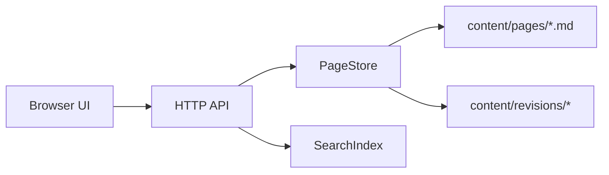

# Wikist Architecture

Wikist 0.1 is a dependency-free Node.js wiki kernel. The first version is intentionally small so it can be audited, modified, and deployed on modest infrastructure.

## Design Sources

- MediaWiki: page plus revision model, community editing, stable article identity.
- Wiki.js: modern single-page reading and editing experience.
- Webman: lightweight runtime mindset, explicit routing, low overhead request flow.

## Runtime Shape



## Core Modules

- `src/server/app.js`: HTTP router and API surface.
- `src/core/page-store.js`: Markdown page loading, saving, revision snapshots.
- `src/core/search-index.js`: Chinese and English token search.
- `src/core/markdown.js`: safe Markdown subset with math-aware blocks.
- `config/site.config.json`: site name, navigation, license, editing policy.

## Storage Model

Each article is a Markdown file with front matter:

```markdown
---
title: 群
summary: ...
categories: [代数学, 群论]
quality: A
---

# 群
```

When a page is saved, the previous version is copied into `content/revisions/<slug>/`.

## Editing Policy

Open editing is enabled by default. In production, set `WIKIST_EDIT_TOKEN` and keep `editing.requireTokenEnv` as `WIKIST_EDIT_TOKEN`. The API then requires `Authorization: Bearer <token>` for writes.

## Future Extension Points

- Pluggable renderer: replace `src/core/markdown.js` with a full Markdown/LaTeX pipeline.
- Database store: implement a store with the same methods as `PageStore`.
- Review workflow: add pending revisions and reviewer approval before publishing.
- Permission provider: replace the simple token check with user accounts or SSO.
