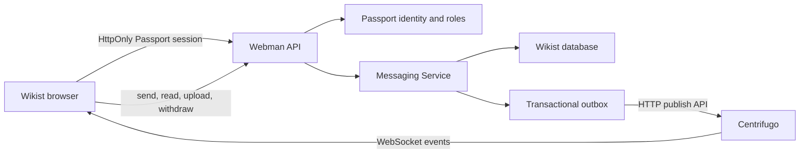

# Wikist Unified Realtime Messaging

Wikist messaging is a collaboration capability inside the knowledge platform,
not an attached IM product. Passport remains the only identity source, Webman
owns every durable decision, and Centrifugo transports already-authorized
events.

## Ownership Boundary



| Concern | Owner |
| --- | --- |
| Login, session, user status, global role | Passport |
| Organization membership and role | Existing Wikist organization tables |
| Conversations, messages, read cursors, mentions, references, attachments | Webman + Wikist database |
| Authorization and input validation | Webman services |
| Delivery channels, presence and ephemeral typing events | Centrifugo |
| Durable message recovery | Wikist API/database |

Centrifugo has no Wikist database credentials. Browser clients receive
short-lived JWTs, cannot publish directly, and must use Webman for every
business write.

## Data Model

- `messaging_conversations`: direct, organization, personal-notification and
  system channels. A sorted `direct_key` makes a user pair idempotent.
- `messaging_conversation_members`: role, notification preference, mute/pin/
  archive state, and one `last_read_message_id` cursor per user and conversation.
- `messaging_messages`: immutable sender snapshot, Markdown/plain body,
  reply target, priority, status and client nonce.
- `messaging_attachments`: private file metadata and ownership. Files stay
  outside `public/` and are served only after conversation authorization.
- `messaging_object_references`: typed references to `wiki_entry`, `revision`,
  `question`, `answer`, `organization` and `user`.
- `messaging_mentions`: normalized user mentions for notification fan-out.
- `messaging_message_hidden`: one viewer/message visibility row for reversible
  per-account deletion. The original message and audit trail remain intact.
- `messaging_presence_leases`: one short-lived lease per user and browser tab.
  Closing, leaving or hiding a tab releases only that tab; the aggregate user
  presence disappears when no fresh lease remains. Crash recovery expires in
  40 seconds by default and never treats Passport sessions as online evidence.
- `messaging_outbox_events`: transactionally records realtime work. A Webman
  process publishes it and retries with bounded backoff.
- `messaging_legacy_links`: idempotent migration bridge for old site messages.

The read cursor prevents a per-message/per-recipient row explosion. Attachments
and references are independent records so future Q&A and AI conversations can
reuse the same message envelope.

## Channels

```text
personal:user:<userId>             user-specific inbox events
conversation:<conversationId>      the currently opened conversation
organization:<organizationId>:activity
system:site                        site announcements
```

Connection JWTs server-subscribe the current user to personal, system and
active-organization activity channels. Opening a conversation requests a
separate short-lived subscription token after Webman verifies membership.
Channel IDs are opaque ASCII public IDs; database primary keys are never used
as authorization evidence.

## Event Envelope

```json
{
  "type": "message.created",
  "occurredAt": "2026-08-09T12:00:00Z",
  "data": {
    "conversationId": "conv_xxx",
    "message": {},
    "actor": { "id": 7, "username": "alice", "displayName": "Alice" }
  }
}
```

Implemented event names include `message.created`, `message.withdrawn`,
`conversation.read`, `presence.typing`, `conversation.moderation.updated`,
`conversation.member.role.updated`, `conversation.member.mute.updated` and
organization/system activity events.
Consumers must be idempotent: the database is authoritative and a recovered
publication may be delivered more than once.

## API Surface

All routes are under `/api/messaging` and require the existing Passport session.

- bootstrap, inbox and paginated conversation listing;
- start idempotent direct or organization conversations;
- paginated message history and message send;
- mark one conversation or the complete inbox read;
- pin, mute and archive membership settings;
- typing, presence and short-lived realtime tokens;
- explicit per-tab heartbeat and offline release;
- closed-by-default direct-message requests, open-mode preferences and offline
  auto replies based on active presence leases;
- authenticated attachment upload/download;
- user and knowledge-object suggestion endpoints;
- paginated conversation-member lookup with site-broadcast privacy;
- sender-only message withdrawal within five minutes;
- per-user soft hide without deleting shared or audited message data.
- organization owner/admin/member roles, timed member mute and all-member mute.

Direct-message writes re-check the recipient immediately before persistence.
Banned and deleted recipients return separate structured errors; the browser
keeps the unsent draft as a local failed bubble with a red delivery marker and
does not create a durable message. System notifications and site broadcasts
are read-only through both the permission service and the rendered workspace.
When a recipient has not enabled open mode and the users do not follow each
other mutually, the sender receives one message request until the recipient
answers. Lease-aware automatic replies are rate-limited and deliberately do
not count as a human answer.

The frontend uses Centrifugo when available and bounded API polling when it is
disabled or unreachable. Realtime updates append or patch message nodes, so a
draft in the composer is never destroyed by a background refresh.

## Production Setup

1. Run `npm run setup:stack`. It creates a pinned Centrifugo runtime, preserves
   existing API/JWT secrets, enables the loopback health probe and writes the
   generated configuration under `data/centrifugo/`.
2. Install the unified service with `sudo npm run service:install --
   --public-url=https://your-domain.example --user=wikist --apply --yes`.
   `/etc/wikist/wikist.env` is authoritative under systemd; startup does not
   write back to the source-tree `.env`.
3. Keep Centrifugo on `127.0.0.1:8902`. Reverse-proxy only the exact
   `/connection/websocket` path; do not expose its HTTP API or health endpoint.
4. Run the production acceptance check:

   ```bash
   sudo npm run doctor:production -- \
     --public-url=https://your-domain.example \
     --service=wikist
   ```

   It checks service ownership, key consistency, all three internal listeners,
   local/public WebSocket upgrades and the active Nginx route without printing
   secrets.
5. The hybrid launcher runs database migration before opening the public
   service. Do not start Webman, the compatibility layer or Centrifugo as
   unrelated long-running processes.

Example Nginx location:

```nginx
location = /connection/websocket {
    proxy_pass http://127.0.0.1:8902;
    proxy_http_version 1.1;
    proxy_set_header Upgrade $http_upgrade;
    proxy_set_header Connection "upgrade";
    proxy_set_header Host $host;
    proxy_set_header Origin $http_origin;
    proxy_set_header X-Forwarded-Proto https;
    proxy_buffering off;
    proxy_read_timeout 3600s;
}
```

A successful raw WebSocket probe returns `101 Switching Protocols`; a later
curl timeout is expected because the upgraded connection remains open. A
public `404` carrying `X-Wikist-Backend: webman` means the WebSocket path fell
through to the generic Webman proxy. See
[Production Troubleshooting](PRODUCTION_TROUBLESHOOTING.md).

For one Centrifugo node, the memory engine is sufficient because Wikist owns
durability. Use Redis only when running several Centrifugo nodes. Channel
history is deliberately short and exists for reconnect recovery, never as a
message database.

## UI And Accessibility

The workspace adapts useful interaction patterns from the MIT-licensed
[chatcn](https://github.com/leonickson1/chatcn) project into Wikist's native
HTML/CSS/Vanilla JS stack: compact conversation list, focused thread, optional
context rail and a reference-aware composer. No React/Next runtime was copied.
Dark/light tokens, keyboard focus, reduced motion, stable mobile list/thread
navigation and authenticated media rendering remain part of the Wikist design
system.

The composer resolves `@username` asynchronously in an upward picker and keeps
knowledge references inside the message source until Wikist renders them.
Article headers can open the same reference-aware flow and forward an entry to
a direct or organization conversation without copying article content.
Opening a conversation clears its local unread badge immediately, then confirms
the read cursor with Webman. Organization member lists are collapsed and
paginated; site broadcasts disclose only an aggregate subscriber count. Public
profiles expose only current short-lease activity, never session or connection
details. Conversation presence is refreshed on Centrifugo subscribe, join and
leave events; bounded heartbeats remain the fallback when realtime transport is
disabled.

## Migration And Removal Criteria

The legacy Node message writer mirrors old notification calls into the unified
tables while modules are migrated. The bridge is idempotent and creates outbox
events. Remove old message endpoints only after:

1. all notification producers call `MessagingService` directly;
2. legacy import/reconciliation reports no unmapped records;
3. API, security and load checks pass against production-like data;
4. the frontend no longer references `/api/passport/messages`.

This keeps one visible product and one durable data model during migration,
without permanently maintaining two messaging backends.
